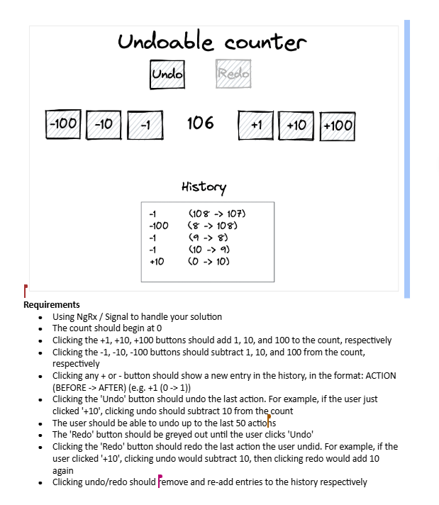

# Undoable Counter — specification

Original assignment mockup and requirements. Implementation lives in this folder (`undoable-counter.store.ts`, `undoable-counter.component.*`).

## UI mockup (original)



## Requirements

- Use **NgRx** or **Signals** for state. This project uses **Angular signals** (`UndoableCounterStore`).
- Count starts at **0**.
- **+1 / +10 / +100** add that amount; **-1 / -10 / -100** subtract that amount.
- Each +/- click appends a history line: `ACTION (BEFORE -> AFTER)` (e.g. `+1 (0 -> 1)`). Newest entries appear at the top.
- **Undo** reverses the last action (e.g. after `+10`, undo subtracts 10). Support undo for up to the last **50** actions.
- **Redo** is disabled until the user has undone at least once; redo re-applies the last undone action.
- **Undo** removes the matching history entry; **redo** puts it back.

## Implementation map

| Requirement | Code |
|-------------|------|
| Signal state | `undoable-counter.store.ts` |
| UI | `undoable-counter.component.html` / `.css` |
| 50-action cap | `MAX_UNDO_ACTIONS` in store |
| History format | `formatHistoryEntry()` |
| Root shell | `src/app/app.html` → `<app-undoable-counter />` |

## Run

```bash
npm start
```
